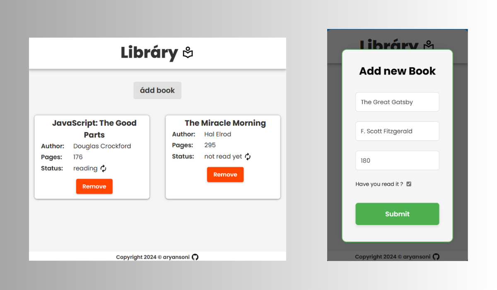

# Library 🪶



You can try the Library app live [here]()! 🌐

## Description

This project, developed as part of "The Odin Project" JavaScript course, is a web application that allows users to manage their personal library collection. Users can easily add new books to their library, specify details such as the title, author, and number of pages, and mark whether they have read the book or not. Additionally, users can remove books from their library and toggle the read status of existing books. 📖


## Table of Contents

| Section              |
| --------------------|
| [Demo](#demo)        |
| [Features](#features)|
| [How to Use](#how-to-use) |
| [Installation](#installation) |
| [Contributing](#contributing) |
| [Contact](#contact)  |
| [Acknowledgements](#acknowledgements) |
| [Additional Note](#additional-note) | 📝


## Features ⚡

- Add books to the library with details such as title, author, and number of pages.
- Toggle the read status of books between "reading" and "completed".
- Remove books from the library.
- Error handling for invalid input and duplicate book titles.
- Use of a dialog modal for adding new books.
- Responsive design for various screen sizes. 


## How to Use 📝

1. Click the "Add Book" button to open the dialog modal.
2. Fill in the required details for the new book (title, author, pages, read status).
3. Click the "Submit" button to add the book to the library.
4. View the added books displayed on the page.
5. Click the "Remove" button to delete a book from the library.
6. Click the toggle button to change the read status of a book.


## Installation 👨‍🔧

There's no need for installation. Simply download or clone the repository to your local machine and open the `index.html` file in a web browser.

```bash
git clone https://github.com/aryansoni-git/odin-library
```
## Navigate to the project directory:

```bash
cd odin-library
```

## Contributing 🤝

Contributions are welcome! If you'd like to contribute to this project, please follow these steps:

1. Fork the repository.
2. Create a new branch (`git checkout -b feature/new-feature`).
3. Make your changes.
4. Commit your changes (`git commit -am 'Add new feature'`).
5. Push to the branch (`git push origin feature/new-feature`).
6. Create a new Pull Request. 

## Contact 👨‍💻


If you have any questions or suggestions regarding this repository, Feel free to connect with me on any of the platforms listed below. I'm excited to hear from you and chat about all things tech!

| Platform | Link |
| --- | --- |
| Email | [](mailto:aryansoni.work@gmail.com) |
| GitHub | [](https://github.com/aryansoni-git) |
| Twitter | [](https://twitter.com/aryansoni_x) |
| LinkedIn | [](https://www.linkedin.com/in/aryansoni-work) |
| Instagram | [aryansoni.ig](https://www.instagram.com/aryansoni.ig/) |

## Acknowledgements 👏

- Special thanks to [The Odin Project](https://www.theodinproject.com/) for providing the educational resources and project idea that inspired this library project.
- Thanks to [Google Fonts](https://fonts.google.com/specimen/Poppins?query=poppins) for providing the Poppins font, which was used in this project.

## Additional Note 📌

This version of the Library project does not include localStorage functionality to save information between page reloads. However, this aspect will be covered later in "The Odin Project" JavaScript course. Stay tuned for updates and enhancements to the project! 🚀